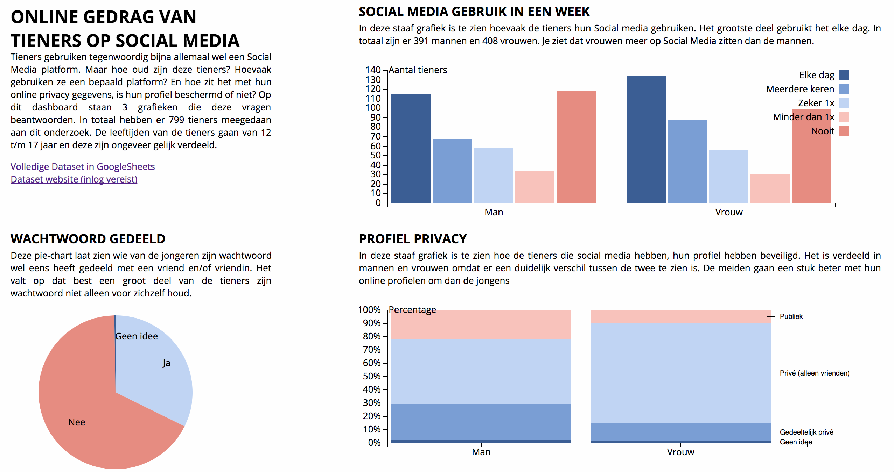

# Project deel A (herkansing) documentatie

Ontwerp een datavisualisatie waaruit een gebruiker (minstens) drie verschillende inzichten (bijv. wie, waar, wanneer, hoe, wat, wie, waarom of combinaties daarvan)
kan opdoen uit jouw datasets. Bron van [https://moodle.cmd.hva.nl](https://moodle.cmd.hva.nl/mod/scheduler/view.php?id=17672)

## Files
* index.html
* index.css
* password.js
* password.csv
* usage.js
* usage.csv
* profile.js
* profile.csv
* readme.md
* preview.png

## Dataset

[Teens Online Behavior's dataset](https://bigml.com/dashboard/dataset/59faf2a6af447f4e92001386).
[Openbaar op Google Sheets](https://docs.google.com/spreadsheets/d/18sk6zNVzZRrxYws7IvG3uqk8sJQHrZb_eo388cijHkU/edit?usp=sharing).
Dit is een uitgebreide dataset met veel verschillende en (voor mij) interessante onderwerpen. Deze dataset is een onderzoek naar online gedrag van tieners tussen de 12 en 17 jaar. De onderwerpen die ik eruit heb gepakt zijn: het delen van wachtwoorden, hoeveelheid gebruik van Social media en de privacy gegevens van hun online profielen. 

Daarnaast kijk ik met het tweede en derde onderwerp naar het verschil tussen de jongens en de meiden van het onderzoek omdat hier een aanzienlijk verschil in zit

## Concept

Het idee is dat je op mijn dashboard direct informatie kan winnen van de tieners op Social media. Het is een logisch verhaal dat van social media gebruik naar de privacy gaat. Door de achtergrond wit en de tekst zwart te houden springen de kleuren van de grafieken er gelijk uit. Zonder te klikken zie je al veel informatie op dit dashboard.

## Techniche aspecten

Dataset
* Van de complete dataset heb ik in totaal drie onderwerpen gepakt en deze apart opgeslagen als 3 losse csv bestanden.
* Deze datasets waren nu verdeeld in 799 personen met een onderwerp daaraan vast.
* Via excel heb ik berekend hoeveel mannen/vrouwen bij een bepaald onderwerp hoorden. 
* Zo heb ik bij bijvoorbeeld 'SOCIAL MEDIA GEBRUIK IN EEN WEEK' gekeken hoeveel personen er bij deze 5 (Minimaal 1x, Elke dag, Minder dan 1x, Nooit, Meerdere keren) hoorden.

Grafieken
* Namen van variabelen aangepast.
* Grootte van grafieken, tekst, lijnen aangepast
* Kleuren van de grafieken aangepast
* Comments bij de code gezet
* Label op Y as toegevoegd
* Tekst aangepast
* Code opgeschoont
* js bestanden per grafiek apart gehouden voor meer overzicht

## Bronnen

* [Pie Chart](https://bl.ocks.org/mbostock/3887235)
* [Grouped Bar Chart](https://bl.ocks.org/mbostock/3887051)
* [Normalized Stacked Bar Chart](https://bl.ocks.org/mbostock/3886394)
* [D3 API Reference](https://github.com/d3/d3/blob/master/API.md#time-formats-d3-time-format)
* [Slack CMD Information](https://cmdinformationdesign.slack.com/messages/C6X4TNPQA/)
* [CMD FE3 course-17-18](https://github.com/cmda-fe3/course-17-18/blob/master/class-1.md)

## License 

Released under the [GNU General Public License, version 3.](https://opensource.org/licenses/GPL-3.0)
